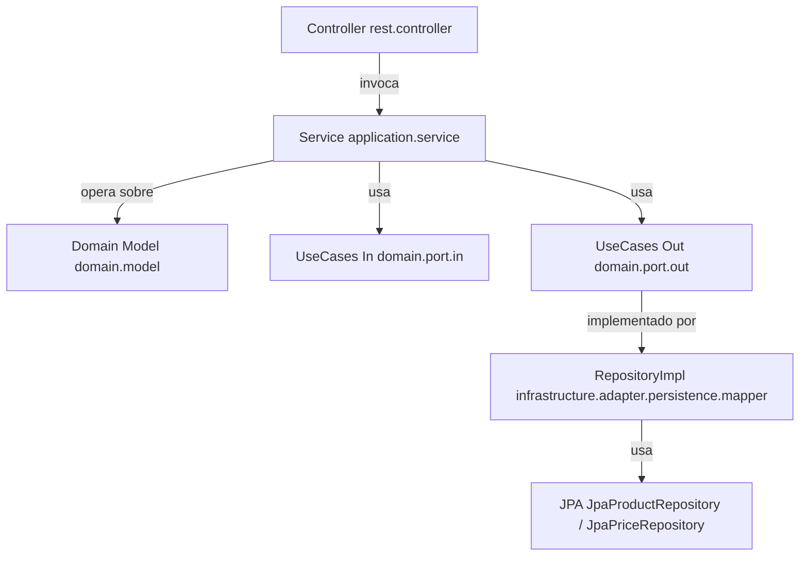

# Mango Products Service

Este servicio gestiona productos y sus precios en el tiempo, asegurando consistencia de reglas de negocio y eficiencia bajo concurrencia. Se construyó siguiendo principios de DDD, arquitectura hexagonal y Clean Architecture.

## Tecnologías

- Java 21
- Spring Boot 3
- JPA + Hibernate
- PostgreSQL (Testcontainers)
- MapStruct
- JUnit 5 + Mockito + MockMvc
- Gradle

---

## Arquitectura

El proyecto sigue una arquitectura hexagonal (Ports & Adapters), separando la lógica del dominio de detalles técnicos como frameworks o persistencia. Se estructura en capas:

### Estructura por capas

- `domain.model`: modelos ricos (`Product`, `Price`) con reglas de negocio.
- `domain.port.in`: define los casos de uso (Command/Query).
- `domain.port.out`: interfaces de repositorios para persistencia.
- `application.service`: orquesta lógica usando entidades + puertos.
- `infrastructure.adapter.persistence`: repositorios JPA y mappers.
- `infrastructure.rest.controller`: expone endpoints HTTP.
- `infrastructure.rest.dto/mapper`: mapea entre entidades, dominio y DTOs.

### Diagrama



---

## Justificación: Separación de Lectura y Escritura (CQRS)

Se aplicó un enfoque inspirado en CQRS dividiendo la lógica en servicios y controladores de **lectura** (`ProductQueryService`) y de **escritura** (`ProductCommandService`).

### ¿Por qué no un CQRS completo?
- Mantiene claridad y separación de responsabilidades sin sobredimensionar.
- Facilita escalar a un CQRS full en el futuro (eventos, proyecciones, etc.).
- Evita acoplamiento entre lectura y escritura.
- Simplifica pruebas unitarias e integración.

---

## Endpoints

### `POST /products`
- Crea un producto (valida unicidad del nombre).

### `POST /products/{id}/prices`
- Agrega un precio nuevo (valida fechas y solapamientos).

### `GET /products/{id}/prices?date=yyyy-MM-dd`
- Consulta el precio activo para una fecha.

### `GET /products/{id}/prices/history`
- Devuelve el historial completo de precios.

**Por qué `/history`**: Se eligió para mantener claridad semántica. Evita sobrecargar `/prices` con múltiples responsabilidades, siguiendo buenas prácticas REST.

---

## Testing

### Unitarios
- Cobertura completa de reglas de negocio.
- Repositorios y mappers mockeados para pruebas aisladas.

### Integración
- Usa `@SpringBootTest` y Testcontainers con PostgreSQL real.
- Valida todo el flujo HTTP con `MockMvc`.

---

## Benchmark de rendimiento

```text
1000  creaciones concurrentes de productos        → 8.43s
20000 consultas concurrentes de precio actual     → 171.00s
15000 consultas de historial de precios           → 128.78s
```

**Conclusión:** Buen rendimiento en escenarios concurrentes. Consultas optimizadas con ordenamiento en BD (`ORDER BY init_date`) para evitar lógica pesada en memoria.

---

## Decisiones Técnicas

- **Separación Command/Query (CQRS light):** Servicios y controladores separados para simplificar responsabilidades y facilitar escalabilidad futura.
- **Arquitectura hexagonal (Ports & Adapters):** Permite un dominio independiente de frameworks.
- **MapStruct:** Evita mapeos manuales entre entidades, DTOs y modelos.
- **Validaciones en el dominio:** Reglas críticas como validación de solapamiento viven dentro de los modelos, no en los controladores.
- **Relación Producto–Precio:** Bidireccional + `cascade` + control explícito para mantener integridad en persistencia.
- **Testing completo:** Unitarios aislados y tests de integración realistas (con DB real vía Testcontainers).
- **OpenAPI/Swagger:** Generación automática de documentación para facilitar exploración de endpoints.

---

## Ejecución

1. Clona el repositorio:

```bash
git clone https://github.com/luiscont88/senior-java-tech-challenge-main.git
cd senior-java-tech-challenge-main
```

2. Levanta la aplicación con Docker Compose:

```bash
docker-compose up --build
```

3. Accede a la documentación Swagger:

```
http://localhost:8080/swagger-ui.html
```

---

## Pruebas (Unitarias + Integración)

1. Asegúrate de tener **Docker corriendo** (usamos Testcontainers con PostgreSQL).
2. Ejecuta todos los tests:

```bash
./gradlew test
```

3. Ejecuta un test específico:

```bash
./gradlew test --tests "com.mango.products.ProductIntegrationTest"
```

4. Consulta el reporte HTML:

```
build/reports/tests/test/index.html
```